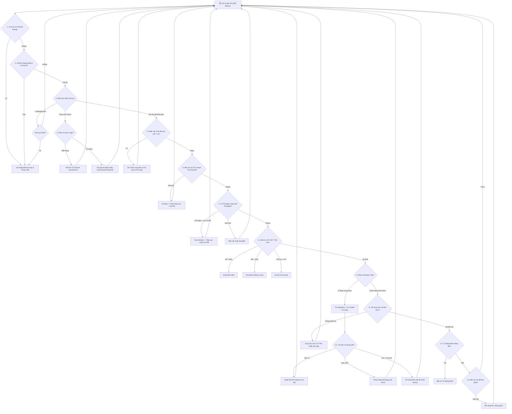

# 🔄 Phân Tích Chi Tiết Vòng Lặp Chính (Main Loop Lifecycle)

> Tài liệu này mô tả chi tiết cách thức vận hành, các điều kiện rẽ nhánh và chu trình sống của vòng lặp trung tâm (`AutoFarm-Watcher`) trong file mã nguồn `src/com/a/d/AutoReconnect.java`.

---

## 1. Khởi Tạo Vòng Lặp (Thread Initialization)

Vòng lặp bot không can thiệp trực tiếp vào Main Render Thread của LibGDX (để tránh gây giảm FPS hoặc đứng hình game). Thay vào đó, bot khởi tạo một **Daemon Thread riêng biệt** mang tên `AutoFarm-Watcher`:

```java
Thread thread2 = new Thread(new Runnable() {
    @Override
    public void run() {
        AutoReconnect.log("[AutoFarm] He thong tu dong di chuyen & tu dong danh san sang!");
        block26: while (true) {
            try {
                while (true) {
                    Thread.sleep(800L); // Chu kỳ lặp 800ms
                    // ... TOÀN BỘ CÁC BƯỚC KIỂM TRA ĐƯỢC THỰC HIỆN TẠI ĐÂY ...
                }
            } catch (Throwable throwable) {
                AutoReconnect.log("[WatcherError] Loi vong lap AutoFarm: " + throwable.getMessage());
                continue;
            }
            break;
        }
    }
});
thread2.setDaemon(true);
thread2.setName("AutoFarm-Watcher");
thread2.start();
```

* **Chu kỳ nhịp tim (Sleep Interval):** `Thread.sleep(800L)` (tức mỗi chu kỳ kéo dài xấp xỉ **800 mili-giây** hay 1.25 lần/giây).
* **Khả năng chịu lỗi (Resilience):** Toàn bộ thân vòng lặp được bao bọc trong khối `try ... catch (Throwable throwable)`. Bất kỳ ngoại lệ nào phát sinh đều được log lại và vòng lặp tiếp tục chạy ở chu kỳ tiếp theo (`continue`), không bao giờ bị dừng tiến trình đột ngột.

---

## 2. Sơ Đồ Khối Vòng Lặp (State Machine Flowchart)



---

## 3. Các Giai Đoạn Kiểm Tra Tuần Tự (Step-by-Step Breakdown)

Mỗi chu kỳ 800ms, vòng lặp thực hiện lần lượt các tác vụ sau:

### Giai đoạn 1: Giám Sát Cửa Sổ & Tài Nguyên LibGDX
* Gọi `GLFW.glfwWindowShouldClose(windowHandle)`. Nếu người dùng bấm dấu **[X]** đóng cửa sổ game:
  - Bot chủ động dừng `httpApiServer.stop(0)`.
  - Ghi log và gọi `System.exit(0)` để Watchdog bên ngoài nhận diện và tự khởi động lại phiên game mới sạch sẽ.
* Nếu `Gdx.app == null` hoặc `Gdx.graphics == null`, tiến trình tự động giải phóng tài nguyên.

### Giai đoạn 2: Watchdog Màn Hình Tải (`LoadingScreen`)
* Khi chuyển map hoặc tải dữ liệu ban đầu, game rơi vào `LoadingScreen` ("Kiểm tra dữ liệu"):
  - Bot bắt đầu đếm thời gian: `l = currentTime - loadingScreenStartTime`.
  - Nếu thời gian treo vượt quá **180 giây (3 phút)**: Cảnh báo kẹt màn hình tải -> Thoát JVM để tiến trình ngoài khởi động lại.
  - Khi thoát khỏi màn hình tải: Tự động reset `loadingScreenStartTime = 0L`.

### Giai đoạn 3: Tự Động Đăng Nhập & Kết Nối Lại (`AutoLogin`)
* Nếu nhân vật chưa vào màn hình game chính (`!bl3`):
  - Kiểm tra cờ `isAutoLoginEnabled()` (dựa trên sự tồn tại của file cấu hình `bat_auto_login.txt` / `tat_auto_login.txt`).
  - Kiểm tra trạng thái socket KryoNet: Nếu `isConnected() == false` -> gửi yêu cầu kết nối TCP tới server cổng mặc định (`serverId = 0`).
  - Nếu đã kết nối mạng nhưng đang ở màn hình đăng nhập: Tự nạp tài khoản từ `saved_account.txt` hoặc `.prefs/account` và thực thi đăng nhập.

### Giai đoạn 4: Hồi Sinh & Xử Lý Kiệt Sức (`Death Recovery`)
* Khi nhân vật hết máu (kiệt sức):
  - Ghi nhận `lastFarmMapName` và `lastFarmMapId` mục tiêu mà nhân vật vừa farm.
  - Gửi gói tin Về Làng an toàn.
  - Sau khi về làng, kích hoạt cờ ưu tiên thu hoạch táo trước khi quay lại đúng bãi farm ban đầu.

### Giai đoạn 5: Chu Kỳ Thu Hoạch Cây Táo (`Periodic Apple Harvest`)
* Cấu hình chu kỳ: `periodicAppleIntervalMs = 360000L` (**6 phút / lần**).
* Khi đến hẹn hoặc sau khi vừa hồi sinh về làng:
  1. Di chuyển nhân vật bước qua cổng vào Nông Trại.
  2. Định vị tọa độ Actor Cây Táo, click tương tác mở menu.
  3. Gửi lệnh thu hoạch quả táo chín, nhận điểm kinh nghiệm và nguyên liệu.
  4. Đóng popup, bước ra cổng và bắt đầu hành trình quay lại bãi farm.

### Giai đoạn 6: Nhận Diện Thỏ Ngọc & Nhặt Item Dã Ngoại
* Quét mảng danh sách thực thể trên map:
  - **Thỏ Ngọc (Rabbit Catch):** Nếu phát hiện Thỏ Ngọc xuất hiện trong phạm vi bản đồ, bot kiểm tra hành trang có củ "Cà Rốt" không. Nếu có -> Tạm dừng tự động đánh, di chuyển áp sát Thỏ Ngọc và gửi gói tin bắt thú bằng Cà Rốt.
  - **Vật phẩm dã ngoại (Wild Drop Items):** Tự động phát hiện các item rơi trên mặt đất, tính khoảng cách Euclidean, tiếp cận và nhặt.

### Giai đoạn 7: Quản Lý Sinh Mệnh, Năng Lượng & Thể Lực
* **Bình Máu (HP):** Nếu $	ext{HP} < 60\% 	ext{MaxHP}$ -> Tự động kích hoạt sử dụng bình hồi máu.
* **Bình Năng Lượng (MP):** Nếu $	ext{MP} < 30\% 	ext{MaxMP}$ -> Tự động kích hoạt sử dụng bình hồi mana.
* **Thể Lực (Stamina):** Nếu Thể Lực $< 50$ điểm -> Tự động tìm trong túi đồ và sử dụng "Đùi gà nướng" để duy trì khả năng nhận exp.
* **Buff Túi Định Kỳ:** Mỗi 30 phút tự động ăn các vật phẩm buff có sẵn trong túi.

### Giai đoạn 8: Định Tuyến Chuyển Map (Waypoint Pathfinding)
* Sử dụng đồ thị chuyển map `routeGraph`:
  - So sánh tên map hiện tại với map farm mục tiêu (`lastFarmMapName`).
  - Nếu đang ở map trung gian: Tìm Waypoint/Cổng dẫn tới chặng tiếp theo.
  - Điều khiển nhân vật di chuyển hướng về tọa độ cổng.
  - Khi khoảng cách tới cổng $< 1.5	ext{m}$, kích hoạt gửi gói tin bước qua cổng.

### Giai đoạn 9: Thuật Toán Giải Kẹt Địa Hình 3 Cấp Độ (Tri-Stage Anti-Stuck)
Khi đang trong trạng thái di chuyển nhưng tọa độ $X$ không tịnh tiến:
1. **Cấp 1 - Box2D Jump:** Tính toán vector gia tốc dựa trên hướng di chuyển và áp dụng xung lực Box2D (`applyLinearImpulse`) để nhân vật bật nhảy qua gờ đá (tối đa 3 lần).
2. **Cấp 2 - Phase Step:** Nếu sau 3 lần nhảy vẫn kẹt tại cùng vị trí, bot áp dụng vận tốc cực đại $15.0	ext{ m/s}$ hướng thẳng về phía mục tiêu để vượt qua điểm nghẽn vật lý.
3. **Cấp 3 - Emergency Recall:** Nếu số chu kỳ kẹt lặp lại vượt quá ngưỡng an toàn (`samePositionStuckCycles > 4`) hoặc thời gian di chuyển vượt quá 6 phút -> Gửi gói tin Về Làng khẩn cấp để thiết lập lại đường đi từ đầu.

### Giai đoạn 10: Quản Lý Nút Tự Động Đánh (Auto Attack Toggle)
* **Khi đã vào đúng map farm:** Bot không bật đánh ngay tại cửa vào map, mà tự động chạy sâu vào bên trong bãi quái (khoảng $75\%$ chiều dài bản đồ), sau đó mới dừng lại và kích hoạt nút **Tự Động Đánh**.
* **Khi đang ở map trung gian hoặc trên đường đi:** Cưỡng chế TẮT nút Tự Động Đánh để ngăn nhân vật dừng lại đánh quái rác ven đường gây chậm tiến độ.

### Giai đoạn 11: Tự Động Đổi Khu Vực (Zone Rotation)
* Chu kỳ mặc định: `zoneChangeIntervalMs = 40000L` (**40 giây / lần**).
* Khi đang treo farm tại map đích, bot tự động lấy danh sách khu vực (Zone 1 - Zone 15) và gửi lệnh đổi khu để phân tán mật độ quái, tối ưu lượng kinh nghiệm thu được.

### Giai đoạn 12: Đội Nhóm (Party) & Nhiệm Vụ Hàng Ngày
* Tự động quét và mời người chơi trong cùng map hoặc trong danh sách bạn bè vào party.
* Nếu là Trưởng nhóm (Party Leader): Tự động duyệt đơn xin gia nhập nhóm của thành viên khác.
* Tự động đồng bộ và nhận thưởng Nhiệm Vụ Hàng Ngay khi đạt điều kiện.

---

## 4. Bảng Tổng Hợp Các Bộ Đếm Thời Gian (Timers & Intervals)

| Tên Biến Bộ Đếm | Chu Kỳ / Ngưỡng | Ý Nghĩa Chức Năng |
| :--- | :--- | :--- |
| `Thread.sleep(800L)` | **800 ms** | Nhịp tim vòng lặp chính của daemon `AutoFarm-Watcher` |
| `periodicAppleIntervalMs` | **360.000 ms (6 phút)** | Chu kỳ tự về làng thu hoạch Cây Táo nông trại |
| `zoneChangeIntervalMs` | **40.000 ms (40 giây)** | Chu kỳ tự động đổi khu vực (Zone) tránh tranh bãi |
| `periodicBagEatIntervalMs` | **1.800.000 ms (30 phút)** | Chu kỳ tự động sử dụng vật phẩm buff trong túi đồ |
| `loadingScreenStartTime` | **180.000 ms (3 phút)** | Ngưỡng timeout màn hình tải trước khi khởi động lại JVM |
| `samePositionStuckCycles` | **4 chu kỳ (~3.2 giây)** | Ngưỡng phát hiện kẹt lặp lại tại cùng toạ độ $X$ |
| `startupLoginAttempts` | **8s / 15s** | Khoảng cách thời gian thử lại đăng nhập (Exponential Backoff) |
