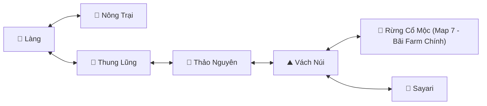
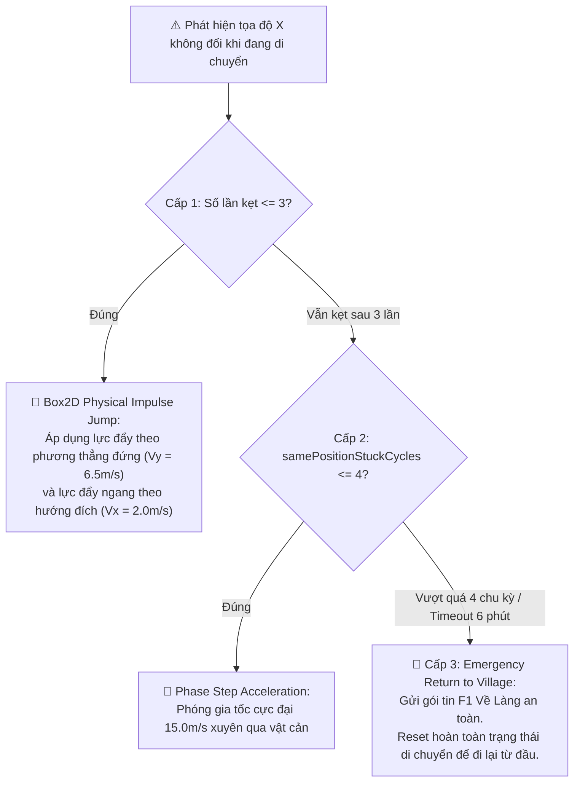

# 🗺️ Hệ Thống Định Tuyến Map & Giải Kẹt 3 Cấp Độ (Navigation & Anti-Stuck)

> Phân tích đồ thị chuyển map tự động, điều khiển Waypoint và thuật toán giải kẹt thông minh kết hợp động lực học vật lý Box2D.

---

## 1. Đồ Thị Chuyển Map Tự Động (Route Graph Pathfinding)

Hệ thống lưu trữ đồ thị liên thông giữa các bản đồ trong game thông qua cấu trúc `routeGraph`:

### Nguyên tắc định tuyến:
1. **Xác định vị trí hiện tại:** Chuẩn hóa tên map hiện tại (loại bỏ dấu tiếng Việt, ký tự đặc biệt).
2. **Tìm đường ngắn nhất:** So sánh map hiện tại với map farm đích (`lastFarmMapName`).
3. **Tìm Waypoint kế tiếp:** Duyệt danh sách các cổng dịch chuyển (Waypoint) trên map hiện tại và chọn cổng dẫn sang map tiếp theo theo đồ thị.
4. **Tiếp cận & Qua cổng:** Di chuyển nhân vật về phía cổng. Khi khoảng cách $\Delta d < 1.5	ext{m}$, gửi gói tin bước qua cổng lên máy chủ.

---

## 2. Thuật Toán Giải Kẹt Địa Hình 3 Cấp Độ (Tri-Stage Anti-Stuck)

Trong các game 2D platformer sử dụng vật lý Box2D, nhân vật rất dễ bị kẹt vào các bậc đá, vách núi hoặc hố sâu khi di chuyển tự động. `AutoReconnect` áp dụng cơ chế giải kẹt leo thang:

### Chi tiết các cấp độ:

#### Cấp 1: Box2D Physical Impulse Jump
* Bot truy cập vào `Body` vật lý Box2D của nhân vật.
* Tính toán vector gia tốc dựa trên hướng di chuyển:
  - Nếu đi sang phải: $V_x = +2.0	ext{ m/s}, V_y = +6.5	ext{ m/s}$.
  - Nếu đi sang trái: $V_x = -2.0	ext{ m/s}, V_y = +6.5	ext{ m/s}$.
* Áp dụng xung lực: `body.applyLinearImpulse(vector, body.getWorldCenter(), true)`.

#### Cấp 2: Phase Step Acceleration
* Khi 3 lần nhảy liên tiếp vẫn không vượt qua được vật cản:
* Bot áp dụng lực đẩy trực tiếp theo vector gia tốc cực đại: $V_x = 15.0	ext{ m/s}$ hướng về phía mục tiêu.

#### Cấp 3: Emergency Recall (Về Làng Khẩn Cấp)
* Nếu nhân vật đứng kẹt tại cùng một vị trí quá 4 chu kỳ lặp liên tiếp (`samePositionStuckCycles > 4`) hoặc thời gian ở map trung gian vượt quá **6 phút**:
* Bot kích hoạt gửi gói tin Về Làng lên server để đưa nhân vật về vùng an toàn, xóa bỏ toàn bộ cờ kẹt và bắt đầu lại lộ trình di chuyển. Kỹ thuật này triệt tiêu hoàn toàn khả năng nhân vật bị rơi vào vòng lặp kẹt vĩnh viễn.
