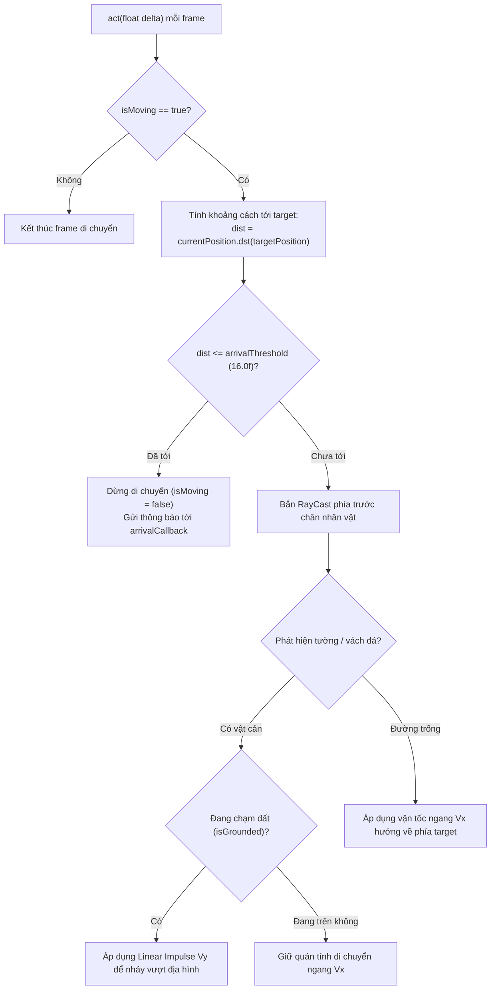

# 🧭 Bản Đồ Ánh Xạ & Phân Tích Kỹ Thuật Lớp Điều Hướng Obfuscate (Navigator & Pathfinding Core)

> Phân tích chuyên sâu hệ thống điều hướng, raycast dò địa hình, phát hiện va chạm Box2D và cơ chế di chuyển nhân vật trong gói `com.a.c.f.a.b.j.*`.

---

## 1. Tổng Quan Kiến Trúc Gói `com.a.c.f.a.b.j.*`

Tất cả các lớp điều hướng và vật lý của nhân vật/quái trong game Tinh Linh được mã hóa theo quy tắc xáo trộn (obfuscation) sử dụng chuỗi lặp `GirlKun75` kết hợp xen kẽ hoa thường (`GIrlKUn75NEKLi...`).

### Cấu trúc phân cấp:
```
com.a.c.f.a.b.j/
├── GIrlKUn75NEKLi...   (Interface / Abstract Navigator Base)
├── GirLKun75nEkLlil... (State Machine / Enum mapping cho điều hướng)
├── GirlkUn75NeKiiIL... (Actor movement controller)
└── a/                  (Subpackage chứa engine vật lý & thuật toán dò đường)
    ├── GirlKun75NekIlliLiLIiiWhAtdOyOuwAnTHereHIhihiHahAHAHOHOHOhEHeHeGiRLKuN75.java  (Core Navigator)
    ├── GirlKun75NekIlliLiLIiiWhAtdOyOuwAnTHere...$GIrlKUn75NEKLi...java               (Navigation Callback)
    ├── GIrLkUn75NEkIlillliLII...                                                      (Box2D RayCast Ground Sensor)
    ├── GIRLkuN75nEkLlLiiLIlLl...                                                      (Waypoint & Trajectory Evaluator)
    └── ... (Các contact listener, kinematic body updater, vector calculator)
```

---

## 2. Lớp Điều Hướng Trọng Tâm: `Navigator`

Lớp chính thực thi toàn bộ logic di chuyển là:
`com.a.c.f.a.b.j.a.GirlKun75NekIlliLiLIiiWhAtdOyOuwAnTHereHIhihiHahAHAHOHOHOhEHeHeGiRLKuN75`

### 2.1 Bảng Ánh Xạ Thuộc Tính Chính (Field Mapping)

| Thuộc Tính Trong Bytecode Obfuscate | Kiểu Dữ Liệu | Tên Ý Nghĩa (Semantic Name) | Mục Đích Hoạt Động |
| :--- | :--- | :--- | :--- |
| `GirlkUn75NeKiiILIiiiILwHaTDoYOuwAntHErEHIHIhIHAhAhAHohOhOHeHEHeGiRLkUN75` | `Vector2` | `targetPosition` | Tọa độ đích $(X_{target}, Y_{target})$ mà nhân vật đang di chuyển tới |
| `GirLKun75nEkLlilLiLlILwHATDOYouWaNtherEHIhIHIHAhahAHoHoHoHEheHegiRlkun75` | `Vector2` | `currentPosition` | Tọa độ thực tế hiện tại được đọc từ Box2D Body |
| `GIRLKUn75NEkLIilIiLLLLwHaTdOyOuWAntHERehiHiHIHAHAhAHohohoheheHegirlkUN75` | `Vector2` | `lastVelocity` | Vector vận tốc tức thời $(-1.0, -1.0)$ khi chưa kích hoạt |
| `GIrLkUn75NEkIlillliLIIwhatDOYOUwaNThEREHIHihIHAHAHAHohohohEHeHEGIrLKuN75` | `Callback` | `arrivalCallback` | Hàm gọi lại (Callback) được kích hoạt khi đến đích ($\Delta d < \epsilon$) |
| `GIRlkUn75nEkLLllLLLlLlwhATDoyOuWanTHEreHIHihihAHAhahoHOhohEHehegirlKUN75` | `float` | `arrivalThreshold` | Ngưỡng khoảng cách chấp nhận hoàn thành di chuyển (mặc định = $16.0f$) |
| `girLkUN75NekLiiiliILiiWhaTdOYOUwaNTHeReHihiHihahAhAHOhOHohEhEHEGiRlKUN75` | `long` | `moveStartTime` | Thời điểm bắt đầu di chuyển (dùng để phát hiện kẹt theo timeout) |
| `GIrlKUn75NEKLiIILilLiLwhAtdOYOuWAntheRehIHIHihAHAHAHohohohEHeHEgiRlkUn75` | `boolean` | `isMoving` | Cờ trạng thái nhân vật đang trong tiến trình tự động di chuyển |

---

### 2.2 Bảng Ánh Xạ Phương Thức Trọng Tâm (Method Mapping)

| Phương Thức Obfuscate | Chữ Ký (Signature) | Tên Chuẩn Hóa | Mô Tả Chức Năng |
| :--- | :--- | :--- | :--- |
| `GIrlKUn75NEKLi...` | `(float targetX, float targetY, Callback cb)` | `setTarget(x, y, cb)` | Thiết lập tọa độ đích mới và đăng ký callback khi đến nơi |
| `GIrlKUn75NEKLi...` | `(Vector2 target, Callback cb)` | `setTarget(vec, cb)` | Overload thiết lập đích bằng đối tượng Vector2 |
| `GIrlKUn75NEKLi...` | `(float delta)` | `act(delta)` | Vòng lặp cập nhật mỗi frame: tính khoảng cách, bắn raycast kiểm tra vực/tường, áp dụng gia tốc Box2D |
| `GirlkUn75NeKii...` | `()` | `stop()` | Hủy bỏ trạng thái di chuyển hiện tại, dừng lực quán tính |
| `GirLKun75nEkLl...` | `(boolean active)` | `setIgnoreObstacles(b)` | Bật/tắt chế độ bỏ qua một số loại va chạm phụ |
| `GIrlKUn75NEKLi...` | `(..., Contact, Manifold, Object)` | `handleContact(...)` | Lắng nghe và xử lý sự kiện va chạm với địa hình (chân chạm đất, tường chặn trước mặt) |
| `GIRlkUn75nEKi...` | `()` | `performJump()` | Kích hoạt xung lực nhảy vật lý theo trục Y khi raycast báo có bậc thềm hoặc chướng ngại vật |

---

## 3. Quy Trình Vận Hành Của Vòng Lặp `act(float delta)`



---

## 4. Tương Tác Giữa `AutoReconnect` và `Navigator`

Lớp `AutoReconnect.java` (được bổ sung trong module bot) trực tiếp điều phối `Navigator` thông qua cơ chế phản xạ (Reflection) hoặc hook byte code:

1. **Giao việc:** `AutoReconnect` lấy tọa độ Waypoint tiếp theo trên bản đồ và gọi `Navigator.setTarget(waypoint.x, waypoint.y, callback)`.
2. **Giám sát:** Trong suốt quá trình `Navigator` điều khiển nhân vật chạy bằng vật lý Box2D, `AutoReconnect` đo đạc tọa độ X theo chu kỳ 1s - 2s:
   - Nếu `Navigator` bị chặn bởi góc tường phức tạp hoặc cơ chế nhảy mặc định không vượt qua được (dẫn tới X không đổi), cơ chế **Tri-Stage Anti-Stuck** của `AutoReconnect` sẽ can thiệp áp dụng xung lực Box2D cưỡng bức ($V_y = 6.5\text{ m/s}$, $V_x = 2.0\text{ m/s}$ hoặc Phase Step $15.0\text{ m/s}$).
   - Nếu kẹt quá 4 chu kỳ hoặc vượt quá 6 phút, bot ra lệnh `Navigator.stop()` và kích hoạt Về Làng khẩn cấp.

---

## 5. Danh Sách Đầy Đủ 28 Class Obfuscate Được Giải Mã

| STT | Tên Lớp Gốc | Kiểu | Mô Tả Chức Năng |
| :---: | :--- | :--- | :--- |
| 1 | `com.a.c.f.a.b.j.GIrlKUn75NEKLi...` | Class | Base Navigation Manager |
| 2 | `com.a.c.f.a.b.j.GirLKun75nEkLl...` | Synthetic | Switch Map Dispatcher cho trạng thái di chuyển |
| 3 | `com.a.c.f.a.b.j.GirlkUn75NeKii...` | Class | Actor Body Movement Controller |
| 4 | `...j.a.GirlKun75NekIlli...` | Class | **Core Navigator: Điều hướng, Raycast, Jump Logic** |
| 5 | `...j.a.GirlKun75NekIlli...$GIrl...` | Interface | Arrival Callback Listener Interface |
| 6 | `...j.a.GIRLKUn75NEkLIil...` | Class | RayCast Collision Filter & Geometry Scanner |
| 7 | `...j.a.GIRLkuN75nEkLlL...` | Class | Waypoint Path Interpolator & Velocity Smoother |
| 8 | `...j.a.GIRlkUn75nEKiLi...` | Class | Box2D Jump Impulse & Kinematic Physics Handler |
| 9 | `...j.a.GIRlkUn75nEkLLl...` | Class | Terrain Slope & Ramp Angle Calculator |
| 10 | `...j.a.GIrLkUn75NEkIli...` | Class | Ground Surface Contact Listener |
| 11 | `...j.a.GIrLkun75NEkIli...` | Class | Air Resistance & Drag Dampener |
| 12 | `...j.a.GIrlKUn75NEKLi...` | Class | Platform Edge / Drop-off Sensor |
| 13 | `...j.a.GiRLkUn75nekiL...` | Class | Portal / Waypoint Trigger Area Monitor |
| 14 | `...j.a.GirLKun75nEkLl...` | Class | Multi-point Route Queue Manager |
| 15 | `...j.a.GirlkUn75NeKii...` | Class | Box2D Dynamic Body Position Synchronizer |
| 16 | `...j.a.GirlkUn75neKiL...` | Class | Obstacle Height & Jump Clearance Analyzer |
| 17 | `...j.a.gIRLkUn75NEkLl...` | Class | Stuck Detector & Micro-Step Fallback Handler |
| 18 | `...j.a.gIRLkuN75nEKli...` | Class | Movement Direction & Orientation Inverter |
| 19 | `...j.a.gIRLkun75NEKLI...` | Class | Gravity & Fall Speed Limiter |
| 20 | `...j.a.gIRLkun75NEKLI...$GIrl...` | Class | Inner Gravity Callback Wrapper |
| 21 | `...j.a.gIrLkUn75nEkIl...` | Class | Horizontal Friction & Ice-Surface Handler |
| 22 | `...j.a.gIrLkuN75NeKlI...` | Class | Wall Cling & Sliding Preventer |
| 23 | `...j.a.gIrLkun75nEKiL...` | Class | Vertical Ladder & Rope Clambering Logic |
| 24 | `...j.a.gIrlKuN75NEKIl...` | Class | Contact Manifold Normal Vector Resolver |
| 25 | `...j.a.giRLKUN75NEKlL...` | Class | Teleportation & Snap-to-Target Coordinator |
| 26 | `...j.a.girLKUn75nEkLi...` | Class | Animation Frame Sync during Movement |
| 27 | `...j.a.girLkUN75NekLi...` | Class | Water / Liquid Surface Buoyancy Sensor |
| 28 | `...j.a.girLkUN75nEKIl...` | Class | Movement Event Dispatcher & Sound Trigger |
