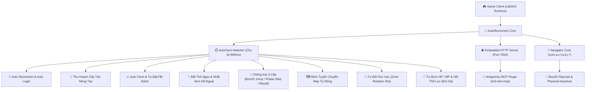

# 🌟 Tinh Linh Game Bot & AutoReconnect System

> **Hệ thống Tự Động Hoá Toàn Diện, Phục Hồi Kết Nối & Giải Mã Engine Điều Hướng Cho Game Tinh Linh (LibGDX + KryoNet + Box2D)**

Hệ thống bot được thiết kế dưới dạng **In-Memory Java Bytecode Patch**, can thiệp trực tiếp vào runtime engine của game Tinh Linh (nền tảng LibGDX & KryoNet socket). Bot cung cấp khả năng tự động chơi 24/7, tự kết nối lại khi mất mạng, giải kẹt địa hình thông minh qua Box2D physics, thu hoạch nông trại, bắt pet Thỏ Ngọc và tích hợp REST API server để kết nối với Antigravity MCP.

---

## 📑 Mục Lục Tài Liệu Chi Tiết

| Tài liệu | Mô tả nội dung |
| :--- | :--- |
| 🧭 **[Bản Đồ Ánh Xạ Navigator & Obfuscation](docs/NAVIGATOR_AND_OBFUSCATION_MAPPING.md)** | **Phân tích toàn diện 28 class obfuscate `com.a.c.f.a.b.j.*`, giải mã engine điều hướng, Raycast và va chạm Box2D.** |
| 🔄 **[Vòng Lặp Chính (Loop Lifecycle)](docs/LOOP_LIFECYCLE.md)** | **Phân tích chi tiết hàm loop `AutoFarm-Watcher`, chu kỳ 800ms, toàn bộ điều kiện rẽ nhánh và luồng thực thi.** |
| 🏛️ **[Kiến Trúc Kỹ Thuật (Architecture)](docs/ARCHITECTURE.md)** | Mô hình đa luồng, cơ chế can thiệp bytecode, hook LibGDX Scene2D và KryoNet. |
| 🔌 **[Auto Reconnect (Tự Động Kết Nối)](docs/AUTO_RECONNECT.md)** | Cơ chế bắt sự kiện đứt kết nối socket, lưu trữ thông tin đăng nhập, retry với backoff. |
| 🗺️ **[Định Tuyến & Chống Kẹt (Navigation & Anti-Stuck)](docs/NAVIGATION_AND_ANTI_STUCK.md)** | Đồ thị chuyển map tự động, thuật toán giải kẹt 3 cấp (Box2D Jump, Phase Step, Recall). |
| 🌐 **[Embedded REST API Server](docs/HTTP_API_SERVER.md)** | Tài liệu HTTP API port `7654` phục vụ Antigravity MCP (`/status`, `/quests`, `/bag`, `/command`). |
| ⚙️ **[Hướng Dẫn Tính Năng & Cấu Hình](docs/FEATURES_GUIDE.md)** | Cấu hình Auto Cây Táo, Thỏ Ngọc, Thể Lực, Potion máu/mana, Đổi khu vực và Hotkeys. |
| 💻 **[Mã Nguồn AutoReconnect](src/com/a/d/AutoReconnect.java)** | Toàn bộ mã nguồn Java hoàn chỉnh (~6.000 dòng) nằm tại `src/com/a/d/AutoReconnect.java`. |
| 📂 **[Mã Nguồn Decompile com.a.c.f.a.b.j.*](src/com/a/c/f/a/b/j/)** | 28 lớp mã nguồn Java decompiled hoàn chỉnh cho lõi di chuyển & điều hướng. |
| 🧱 **[Compiled Classes Bytecode](classes/)** | Toàn bộ 28 file bytecode `.class` nguyên bản trích xuất từ `game.exe`. |
| 📚 **[Thư Viện Standalone JAR](libs/)** | Gói `.jar` độc lập `com-a-c-f-a-b-j.jar` phục vụ import, tái sử dụng và phân tích. |

---

## 🎯 Tính Năng Nổi Bật

1. **Auto Reconnect & Auto Login Tuyệt Đối**:
   - Lắng nghe sự kiện đứt socket từ KryoNet.
   - Tự động kết nối lại TCP socket và gửi gói tin đăng nhập từ tài khoản lưu trong `saved_account.txt`.
   - Có cơ chế cờ điều khiển: `bat_auto_login.txt` (bật) và `tat_auto_login.txt` (tắt).

2. **Vòng Lặp Giám Sát Thông Minh (`AutoFarm-Watcher`)**:
   - Chạy trên một Daemon Thread độc lập với chu kỳ **800ms**, không làm gián đoạn luồng render đồ hoạ chính của LibGDX.
   - Xem chi tiết tại [docs/LOOP_LIFECYCLE.md](docs/LOOP_LIFECYCLE.md).

3. **Cơ Chế Giải Kẹt Địa Hình 3 Cấp Độ (Tri-Stage Anti-Stuck)**:
   - **Cấp 1 - Box2D Jump**: Tự động tính toán hướng và áp dụng xung lực vật lý (`applyLinearImpulse`) để nhân vật nhảy qua bậc đá hoặc chướng ngại vật (thử tối đa 3 lần).
   - **Cấp 2 - Phase Step**: Nếu vẫn kẹt tại cùng toạ độ sau 3 lần nhảy, kích hoạt xung lực gia tốc cực mạnh ($15\text{ m/s}$) hướng về phía mục tiêu.
   - **Cấp 3 - Emergency Recall**: Nếu kẹt quá số chu kỳ cho phép hoặc timeout 6 phút, tự động gửi gói tin Về Làng an toàn để reset hoàn toàn lộ trình.

4. **Thu Hoạch Nông Trại & Bắt Thỏ Ngọc**:
   - Chu kỳ 6 phút tự về làng, bước vào cổng Nông Trại, mở giao diện Cây Táo và thu hoạch trái chín.
   - Tự động phát hiện NPC Thỏ Ngọc trên bản đồ, kiểm tra củ Cà Rốt trong túi và tiếp cận ném bắt.
   - Tự động nhặt các vật phẩm dã ngoại rơi trên đất.
