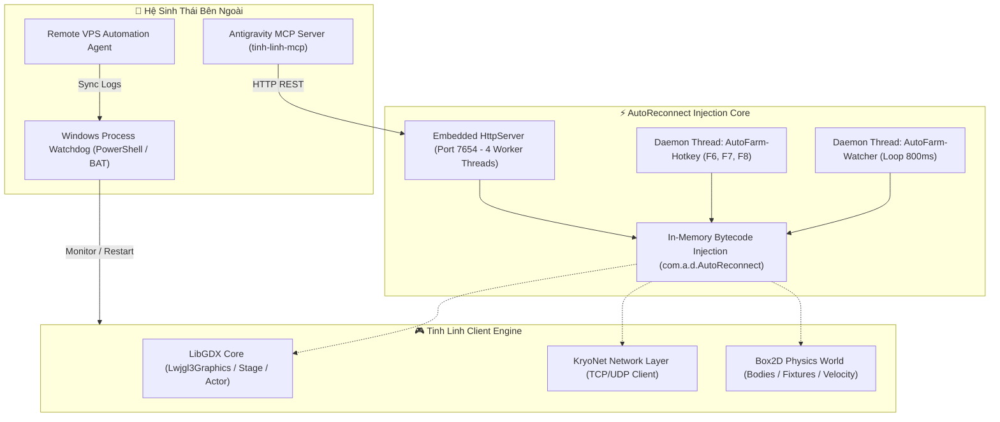

# 🏛️ Kiến Trúc Kỹ Thuật (Architecture Overview)

> Tài liệu mô tả kiến trúc tầng sâu, mô hình can thiệp bytecode và cấu trúc đa luồng của hệ thống `AutoReconnect`.

---

## 1. Mô Hình Tầng Kiến Trúc (Architecture Layers)

---

## 2. Các Luồng Thực Thi (Threading Model)

Hệ thống phân chia nhiệm vụ trên các luồng độc lập để đảm bảo an toàn và tối đa hiệu năng:

| Tên Luồng (Thread Name) | Loại Luồng | Tần Số / Chu Kỳ | Nhiệm Vụ Trọng Tâm |
| :--- | :--- | :--- | :--- |
| **Main Render Thread** | Foreground | ~60 FPS (16ms) | Vòng lặp render chính của LibGDX; vẽ đồ họa và nhận sự kiện chuột/phím từ hệ điều hành. |
| **`AutoFarm-Watcher`** | Daemon | 800 ms | Vòng lặp chính của bot; kiểm tra tọa độ, phát hiện kẹt, điều hướng map, quản lý máu/mana. |
| **`AutoFarm-Hotkey`** | Daemon | Event-Driven | Lắng nghe các phím tắt quản trị từ người dùng (`F6`: thu hoạch táo, `F7`: ăn item buff, `F8`: đồng bộ nhiệm vụ). |
| **`HttpApi-Worker`** | Daemon (Pool 4) | Theo yêu cầu HTTP | Nhận và xử lý các cuộc gọi REST API từ Antigravity MCP qua cổng 7654. |
| **`KryoNet-Client`** | Daemon | Event-Driven | Tiếp nhận gói tin nhị phân từ server game, kích hoạt các listener giải mã và xử lý sự kiện ngắt mạng. |

---

## 3. Kỹ Thuật Can Thiệp Bytecode (Bytecode Patching)

Mã nguồn `AutoReconnect` được biên dịch thành class nhị phân và đóng gói trực tiếp vào file thực thi `game.exe`:
- **Đóng gói trực tiếp:** Được nạp vào cùng classloader với engine game tại package `com.a.d.AutoReconnect`.
- **Reflection & Obfuscation Mapping:** Sử dụng Reflection để truy cập an toàn vào các trường dữ liệu và phương thức bị làm mờ (obfuscated) của game mà không làm hỏng cấu trúc nhị phân gốc.
- **Atomic State Holders:** Sử dụng `volatile`, `AtomicReference` và `ConcurrentHashMap` để đồng bộ dữ liệu an toàn giữa luồng render LibGDX, luồng daemon bot và luồng HTTP worker.
