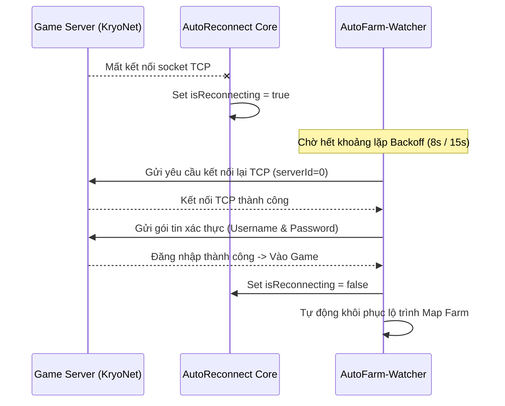

# 🔌 Cơ Chế Tự Động Kết Nối Lại & Đăng Nhập (Auto Reconnect & Login)

> Phân tích cơ chế bắt sự kiện đứt mạng socket KryoNet, lưu trữ thông tin tài khoản an toàn và chiến lược phục hồi phiên chơi tự động.

---

## 1. Cơ Chế Bắt Sự Kiện Đứt Kết Nối (KryoNet Disconnect Hook)

Game Tinh Linh sử dụng thư viện mạng **KryoNet** để giao tiếp nhị phân dạng TCP/UDP. Lớp `AutoReconnect` đăng ký một `Listener` lắng nghe trực tiếp sự kiện ngắt kết nối:

```java
public void disconnected(Connection connection) {
    AutoReconnect.log("[AutoReconnect] Phat hien mat ket noi toi game server!");
    isReconnecting = true;
    // Kích hoạt chu trình phục hồi kết nối tự động
}
```

Khi sự kiện xảy ra:
1. Đặt cờ `isReconnecting = true` để tạm dừng các logic farm khác, tránh gửi gói tin rác khi socket đã đóng.
2. Ghi nhận thời điểm ngắt mạng để bắt đầu tính thời gian hồi phục (Backoff).

---

## 2. Lưu Trữ & Nạp Thông Tin Tài Khoản (Account Persistence)

Bot hỗ trợ khôi phục tài khoản từ 2 nguồn:

1. **File cấu hình cục bộ `saved_account.txt`:**
   - Bot kiểm tra lần lượt các đường dẫn: `saved_account.txt`, `C:\TinhLinh\saved_account.txt`, `d:\tinhlinh\TinhLinh_Lite\saved_account.txt`.
   - Định dạng lưu: `username:password`.
2. **Preferences của hệ điều hành:**
   - Đọc trực tiếp từ `%USERPROFILE%/.prefs/account` nếu file `saved_account.txt` chưa được tạo.
   - Trích xuất tự động `username0` và `password0`.

---

## 3. Chiến Lược Thử Lại (Exponential Backoff Strategy)

Để tránh bị máy chủ game tạm khoá IP do gửi yêu cầu kết nối dồn dập khi server bảo trì hoặc mạng chập chờn:
- **3 lần thử đầu tiên:** Khoảng cách giữa mỗi lần thử là **8 giây** (`8000L`).
- **Từ lần thử thứ 4 trở đi:** Khoảng cách tăng lên **15 giây** (`15000L`).



---

## 4. Các Cờ Điều Khiển Bằng File (File Flags)

Người dùng có thể bật hoặc tắt tính năng Auto Login mà không cần sửa code:
- **Tắt Auto Login:** Tạo file `tat_auto_login.txt` hoặc `no_auto_login.txt` trong thư mục game.
- **Bật Auto Login:** Tạo file `bat_auto_login.txt`.
- Nếu phát hiện đang chạy trên máy thật (thư mục chứa chuỗi `maythat` hoặc `may_that`), tính năng auto login mặc định tắt để người dùng tự do nhập tài khoản phụ.
