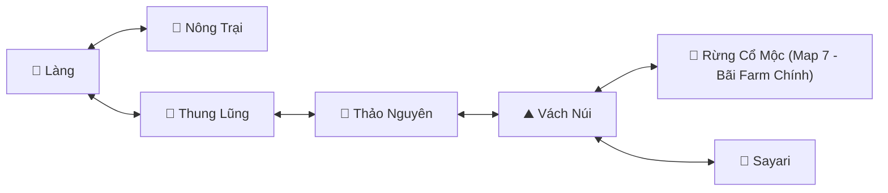
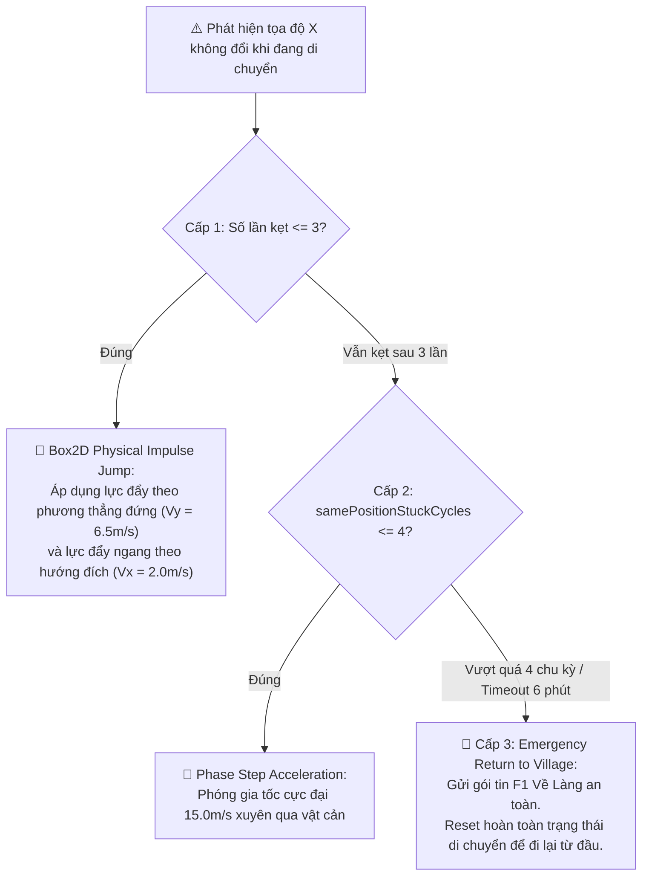

# 🗺️ Hệ Thống Định Tuyến Map & Giải Kẹt 3 Cấp Độ (Navigation & Anti-Stuck)

> Phân tích đồ thị chuyển map tự động, điều khiển Waypoint và thuật toán giải kẹt thông minh kết hợp động lực học vật lý Box2D.

---

## 1. Đồ Thị Chuyển Map Tự Động (Route Graph Pathfinding)

Hệ thống lưu trữ đồ thị liên thông giữa các bản đồ trong game thông qua cấu trúc `routeGraph`:



### Nguyên tắc định tuyến:
1. **Xác định vị trí hiện tại:** Chuẩn hóa tên map hiện tại (loại bỏ dấu tiếng Việt, ký tự đặc biệt).
2. **Tìm đường ngắn nhất:** So sánh map hiện tại với map farm đích (`lastFarmMapName`).
3. **Tìm Waypoint kế tiếp:** Duyệt danh sách các cổng dịch chuyển (Waypoint) trên map hiện tại và chọn cổng dẫn sang map tiếp theo theo đồ thị.
4. **Tiếp cận & Qua cổng:** Di chuyển nhân vật về phía cổng. Khi khoảng cách $\Delta d < 1.5	ext{m}$, gửi gói tin bước qua cổng lên máy chủ.

---

## 2. Thuật Toán Giải Kẹt Địa Hình 3 Cấp Độ (Tri-Stage Anti-Stuck)

Trong các game 2D platformer sử dụng vật lý Box2D, nhân vật rất dễ bị kẹt vào các bậc đá, vách núi hoặc hố sâu khi di chuyển tự động. `AutoReconnect` áp dụng cơ chế giải kẹt leo thang:



### Chi tiết các cấp độ:

#### Cấp 1: Box2D Physical Impulse Jump
* Bot truy cập vào `Body` vật lý Box2D của nhân vật.
* Tính toán vector gia tốc dựa trên hướng di chuyển:
  - Nếu đi sang phải: $V_x = +2.0	ext{ m/s}, V_y = +6.5	ext{ m/s}$.
  - Nếu đi sang trái: $V_x = -2.0	ext{ m/s}, V_y = +6.5	ext{ m/s}$.
* Áp dụng xung lực: `body.applyLinearImpulse(vector, body.getWorldCenter(), true)`.

#### Cấp 2: Phase Step Acceleration & Decoupling
* Khi 3 lần nhảy liên tiếp vẫn không vượt qua được vật cản:
* Bot chuyển sang trạng thái `MOVE_PHASE_STEP` và áp dụng lực đẩy trực tiếp theo vector gia tốc cực đại: $V_x = 12.0 - 15.0\text{ m/s}, V_y = 22.0\text{ m/s}$ hướng về phía mục tiêu.
* **Độc quyền điều khiển (Decoupling):** Triệt tiêu hoàn toàn lệnh gọi Controller (`controller.setWaypoint()`) trong callback của Phase Step để tránh xung đột hai bên cùng ghi đè Body velocity.

#### Cấp 3: Emergency Recall (Về Làng Khẩn Cấp)
* Nếu nhân vật đứng kẹt tại cùng một vị trí quá 3 chu kỳ lặp liên tiếp (`samePositionStuckCycles >= 3`) hoặc thời gian ở map trung gian vượt quá **6 phút**:
* Bot kích hoạt trạng thái `MOVE_STOP` và gửi gói tin Về Làng lên server để đưa nhân vật về vùng an toàn, xóa bỏ toàn bộ cờ kẹt và bắt đầu lại lộ trình di chuyển. Kỹ thuật này triệt tiêu hoàn toàn khả năng nhân vật bị rơi vào vòng lặp kẹt vĩnh viễn.

---

## 3. Kiến Trúc Movement State Machine & Telemetry Guard (TEST6)

Hệ thống di chuyển áp dụng mô hình 4 tầng kiểm soát:

```
                    MOVEMENT STATE
                         │
              ┌──────────┴──────────┐
              │                     │
         commandId              movementMode
         (AtomicLong)           (MOVE_NORMAL / JUMP / PHASE / PORTAL / STOP)
              │                     │
              └──────────┬──────────┘
                         ↓
                  postRunnable(cmdId)
                         ↓
             Kiểm tra isMovementCommandValid(cmdId, mode)
                         ↓
               Ghi Box2D Body Velocity
```

### Các nguyên tắc cốt lõi:
1. **Command Invalidation:** Mọi `Runnable` chuyển giao vào `Gdx.app.postRunnable` đều mang một `commandId` duy nhất từ `newMovementCommand(mode)`. Nếu một lệnh mới phát sinh trước khi callback chạy, callback cũ tự hủy lập tức (`isMovementCommandValid == false`).
2. **Portal Lock:** Khi gửi lệnh qua cổng (`MOVE_PORTAL`), mọi thao tác ghi velocity từ Normal Movement hay Near Gate đều bị khóa tuyệt đối.
3. **Phát hiện kẹt 2D:** Đo lường tiến độ dịch chuyển bằng $\text{progress} = \sqrt{\Delta x^2 + \Delta y^2}$ kết hợp tiến độ khoảng cách đích $\Delta d = d_{\text{trước}} - d_{\text{hiện tại}}$, loại bỏ hoàn toàn việc nhận diện kẹt sai khi nhân vật di chuyển dọc trục Y.
4. **Telemetry Before/After (`[MoveDebug]`):** Ghi log quả tang `cmdId`, `pos`, `velBefore`, `dir` trước khi ghi, và `posAfter`, `velAfter` ngay sau khi ghi, giúp phân định rõ ràng giữa Va chạm vật lý (Case A), Tranh chấp Controller (Case B), Server Snap-back (Case C) và Lệch pha hiển thị (Case D).

